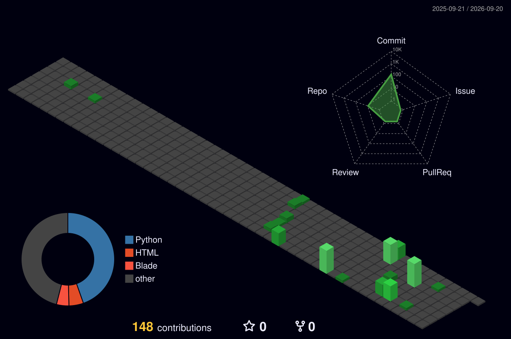

# ** Hi, I'm Saratchandra Mouli Devarakonda**  
💻 **Final Year Computer & Communication Engineering Student @ Manipal Institute of Technology**  
🤖 **Pursuing Minor Specialization in Cybersecurity**  
🚀 **Passionate about Artificial Intelligence & Machine Learning**  

✨ I love building intelligent systems that combine **AI + Machine Learning** to solve real-world problems.  
🔍 Currently exploring **LLMs, IoT, and Blockchain Security**, while contributing to **open-source projects**.  
🌱 On a mission to **learn, build, and innovate every day**.  
##  Skills & Technologies

### Programming Languages  

 
  

### Frameworks & Libraries  
 
 
 
 
 
 

 
  

### Artificial Intelligence & Machine learning

### ☁️ Cloud & Database  
 
 
 
 

### 🛠 Version Control & Project Management  
 
 
 
  

## 💼 Professional Experience

<!-- CSIR -->

  
  <h3 style="margin:0;">🗃️ Web-development Intern</h3>
  <a href="https://www.csir4pi.res.in/">CSIR – Fourth Paradigm Institute</a> &nbsp;&nbsp;&nbsp; Feb 2026 – May 2026

<ul>
  <li>Built a Django-based research/internship application portal (N.S.W.-v7.0) with Role-Based Access Control for applicant review workflows.</li>
  <li>Implemented server-side validation, secure resume uploads, and automated PDF/CSV report generation for admins.</li>
</ul>

 

<!-- DRDL -->

  
  <h3 style="margin:0;">🛡️ Cybersecurity Intern</h3>
  <a href="https://www.drdo.gov.in/">DRDL, DRDO</a> &nbsp;&nbsp;&nbsp; Jun 2025 – Jul 2025

<ul>
  <li>Developed a hybrid phishing detection pipeline (PhishGuard-v6.2) combining a calibrated Scikit-learn classifier with VirusTotal/WHOIS threat intelligence and email/visual-similarity checks.</li>
  <li>Validated model performance across a 27-case test suite, documenting precision and recall results for internal review.</li>
</ul>

 

<!-- Visakhapatnam Steel Plant -->

  
  <h3 style="margin:0;">⚡ Full Stack Intern</h3>
  <a href="https://www.vizagsteel.com/">Visakhapatnam Steel Plant</a> &nbsp;&nbsp;&nbsp; Jun 2024 – Jul 2024

<ul>
  <li>Built a Laravel-based delay analytics dashboard (DelayOps-v1.3) with drill-down filtering to monitor downtime events.</li>
  <li>Designed MySQL schemas and API-served, paginated tables for high-volume operational log reporting.</li>
</ul>

## 🔧 Featured Projects  

### 🗃️ N.S.W. – Research & Internship Application Portal (2026)

A Django-based portal for managing academic internship and thesis applications, built during a Cybersecurity Internship at CSIR – Fourth Paradigm Institute. [[GitHub]](https://github.com/Alpha-Beta-810/N.S.W.-v7.0)

 

- **🔐 Implemented Role-Based Access Control (RBAC) separating superadmin and reviewer permissions across the applicant review workflow**
- **📝 Built a dynamic applicant form with client- and server-side validation, including automated project-duration and PhD vs. UG/PG eligibility logic**
- **📄 Delivered an admin review workflow with CSV/PDF export (ReportLab) and secure resume upload handling**

**Tech Stack:** `Python` `Django` `SQLite` `PostgreSQL` `Bootstrap 5` `ReportLab`

### 🔍 MailGlass – Hybrid Phishing Email Detection System (2025)

An AI-powered email threat-analysis platform combining blacklist-based checks (whitelist, PhishTank, VirusTotal) with an ML fallback classifier and domain intelligence. [[GitHub]](https://github.com/Alpha-Beta-810/MailGlass-v3.1)

 

- **🧠 Combined whitelist/PhishTank/VirusTotal blacklist checks with a Random Forest ML fallback classifier and a weighted, explainable risk score**
- **🌍 Added WHOIS domain-age lookups plus IDN/homograph and typosquat detection for look-alike brand domains**
- **📜 Introduced persistent SQLite scan history (v3.1) with a dashboard to browse, filter, and export past scans as CSV/JSON**

**Tech Stack:** `Python` `Flask` `Scikit-learn` `SQLite` `WHOIS` `PhishTank API` `VirusTotal API`

### 🛡️ PhishGuard – Hybrid Phishing Detection System (2025)

A hybrid threat-detection engine built during an Engineering Analyst Internship at DRDL, DRDO. [[GitHub]](https://github.com/Alpha-Beta-810/PhishGuard-v6.2)

- **🧠 Combined a calibrated Random Forest classifier with live VirusTotal/WHOIS intelligence, plus email-scan and brand visual-similarity fingerprinting**
- **✅ Validated against a 27-case test suite, achieving 100% detection on phishing/typosquat samples**
- **🔌 Exposed REST endpoints for single, batch, and email analysis**

**Tech Stack:** `Python` `Flask` `Scikit-learn` `WHOIS API` `VirusTotal API`

### ⚡ DelayOps – Delay Analytics Dashboard (2024)

A Laravel-based operations dashboard for delay monitoring, built during an Engineering Analyst Internship at Visakhapatnam Steel Plant. [[GitHub]](https://github.com/Alpha-Beta-810/DelayOps-v1.3)

- **📊 Built equipment/sub-equipment drill-down filtering with dynamic unassigned-time alerts**
- **🗄️ Replaced static demo data with a database-driven module backed by MySQL**
- **🔌 Served paginated, searchable data tables via REST API endpoints**

**Tech Stack:** `PHP (Laravel)` `MySQL` `Tailwind CSS` `JavaScript (Vite)`

<!-- ###  Simple RAG Service for Website Q&A (2026)

This project is a simple, self-contained Retrieval-Augmented Generation (RAG) service. Given a starting URL, it crawls a website, indexes its content, and answers questions strictly based on the information it has collected, providing citations for its answers. [[GitHub]](https://github.com/Alpha-Beta-810/Konduit_SDE-Intern-Take_Home_Round_1_Assignment)

- **🛠️ Engineered an End-to-End RAG Pipeline using FastAPI and Scrapy to ingest and index web content, utilizing ChromaDB for vector storage and Sentence Transformers for semantic search.**
- **🌐 Integrated a local Llama 3 model via Ollama, applying strict prompt engineering guardrails**
- **☁️ Optimized Data Ingestion & Retrieval.**

**Tech Stack:** `Python` `FastAPI` `Scrapy` `ChromaDB` `Sentence Transformers` `Ollama (Llama 3)` -->

## 🎓 Education 

- Bachelor of Technology, Computer Science and Engineering 
- Minor Specialization in Computational Intelligence

**Manipal Institute of Technology**  • Sep 2022 – July 2026
- **Relevant Coursework:**
  - Data Structures & Algorithms
  - Object Oriented Programming
  - Operating Systems 
  - Computer Networks
  - Soft Computing Paradigms
  - Artificial Intelligence 
  - Machine Learning
  - Computer Vision
  - Parallel Computing
  - Blockchain Technology

<!--## 📝 Publications
- **Pollution Predictor** : A machine Learning Model For Forecasting Air Quality (Minor Project Publication )
- **Medisure Type 2 Diabetes Predictor** (Undergoing)

## 💡 Patents
- IN23/2404 **Application No. 202441091887** Device and method for monitoring blood parameters of a user (Early Publication available)-->

## 📈 GitHub Stats & Activity  

 

  

### 📊 Contribution Graph  

  

### 🔥 GitHub Streaks  

  

---

---

## 🗂️ Top Languages  

---

